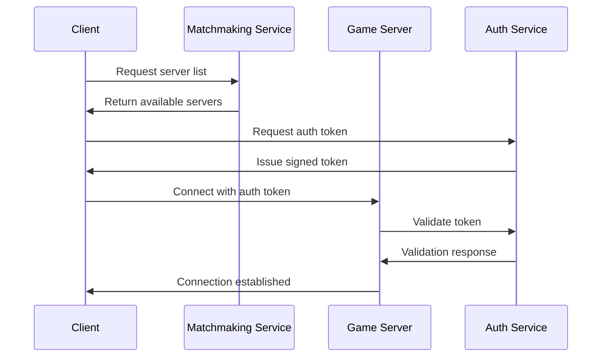
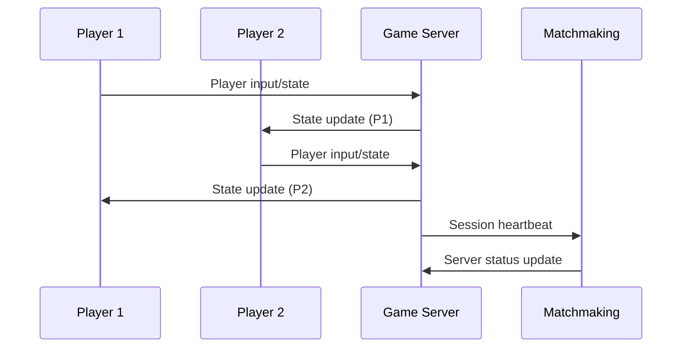
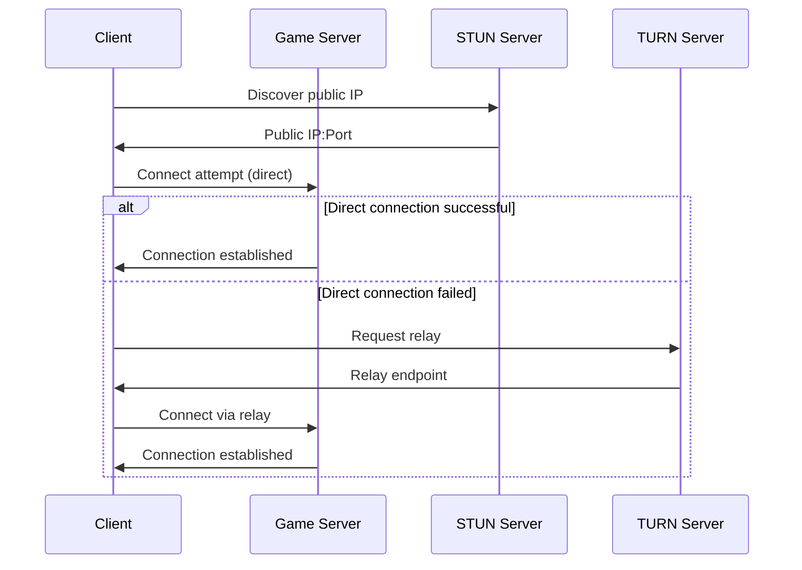

# Internet Multiplayer System - Complete Architecture Diagram

## System Overview

```
┌─────────────────────────────────────────────────────────────────────────────┐
│                            INTERNET MULTIPLAYER SYSTEM                      │
│                         (Public Server Infrastructure)                      │
└─────────────────────────────────────────────────────────────────────────────┘
                                     │
                                     ▼
┌─────────────────────────────────────────────────────────────────────────────┐
│                            MASTER SERVER LAYER                              │
│  ┌─────────────────┐      ┌─────────────────┐      ┌─────────────────┐      │
│  │ Matchmaking     │ ◄─── │   DNS & Load    │ ───► │  Authentication │      │
│  │ Service         │      │   Balancer      │      │  Service        │      │
│  └─────────────────┘      └─────────────────┘      └─────────────────┘      │
└─────────────────────────────────────────────────────────────────────────────┘
                                     │
                                     ▼
┌─────────────────────────────────────────────────────────────────────────────┐
│                            GAME SERVER LAYER                                │
│  ┌─────────────────┐      ┌─────────────────┐      ┌─────────────────┐      │
│  │ Public Server   │ ◄─── │   NAT Traversal │ ───► │  Session        │      │
│  │ Instances       │      │   Service       │      │  Management     │      │
│  └─────────────────┘      └─────────────────┘      └─────────────────┘      │
└─────────────────────────────────────────────────────────────────────────────┘
                                     │
                                     ▼
┌─────────────────────────────────────────────────────────────────────────────┐
│                            CLIENT LAYER                                     │
│  ┌─────────────────┐      ┌─────────────────┐      ┌─────────────────┐      │
│  │ Game Client     │ ◄─── │   Internet      │ ───► │  Security       │      │
│  │ Application     │      │   Multiplayer   │      │  Handler        │      │
│  └─────────────────┘      └─────────────────┘      └─────────────────┘      │
└─────────────────────────────────────────────────────────────────────────────┘
```

## Component Relationships

### 1. Master Server Layer
```
┌─────────────────────────────────────────────────────────────────────────────┐
│                            MASTER SERVER COMPONENTS                         │
├─────────────────────────────────────────────────────────────────────────────┤
│                                                                             │
│  Matchmaking Service ────┐          Authentication Service ────┐            │
│  • Server discovery      │          • Player authentication    │            │
│  • Lobby management      │          • Token validation         │            │
│  • Player matching       │          • Session security         │            │
│  • Region-based routing  │          • Anti-cheat enforcement   │            │
│                          │                                     │            │
│  DNS & Load Balancer ────┘                                     │            │
│  • Server distribution   │          Database ──────────────────┘            │
│  • Traffic management    │          • Player profiles                       │
│  • Health monitoring     │          • Server listings                       │
│  • Failover handling     │          • Match history                         │
│                          │          • Security logs                         │
└─────────────────────────────────────────────────────────────────────────────┘
```

### 2. Game Server Layer
```
┌─────────────────────────────────────────────────────────────────────────────┐
│                            GAME SERVER COMPONENTS                           │
├─────────────────────────────────────────────────────────────────────────────┤
│                                                                             │
│  Public Server Instances ───┐        NAT Traversal Service ───┐             │
│  • Game session hosting     │        • STUN server integration│             │
│  • Real-time synchronization│        • TURN relay fallback    │             │
│  • Player state management  │        • ICE protocol handling  │             │
│  • Physics simulation       │        • Port mapping           │             │
│                             │                                 │             │
│  Session Management ────────┘        Monitoring Service ──────┘             │
│  • Session persistence      │        • Performance monitoring │             │
│  • Player connection handling        • Resource allocation    │             │
│  • Game state backup        │        • Auto-scaling           │             │
│  • Disaster recovery        │        • Log aggregation        │             │
└─────────────────────────────────────────────────────────────────────────────┘
```

### 3. Client Layer
```
┌─────────────────────────────────────────────────────────────────────────────┐
│                            CLIENT COMPONENTS                                │
├─────────────────────────────────────────────────────────────────────────────┤
│                                                                             │
│  Game Client Application ──┐        Internet Multiplayer ───┐               │
│  • User interface          │        • Server browser        │               │
│  • Game rendering          │        • Connection management │               │
│  • Input handling          │        • NAT hole punching     │               │
│  • Local game state        │        • Session joining       │               │
│                            │        • Player matching       │               │
│  Security Handler ─────────┘        Data Synchronization ───┘               │
│  • Encryption/decryption   │        • Position interpolation│               │
│  • Token management        │        • State prediction      │               │
│  • Cheat detection         │        • Network optimization  │               │
│  • Input validation        │        • Lag compensation      │               │
└─────────────────────────────────────────────────────────────────────────────┘
```

## Data Flow Sequence

### 1. Server Discovery & Connection


### 2. Game Session


### 3. NAT Traversal


## Security Architecture

```
┌─────────────────────────────────────────────────────────────────────────────┐
│                            SECURITY LAYERS                                  │
├─────────────────────────────────────────────────────────────────────────────┤
│                                                                             │
│  Application Layer ───────┐          Network Layer ───────┐                 │
│  • Input validation       │          • TLS encryption     │                 │
│  • Cheat detection        │          • VPN integration    │                 │
│  • Session management     │          • Firewall rules     │                 │
│  • Token authentication   │          • DDoS protection    │                 │
│                           │                               │                 │
│  Data Layer ──────────────┘          Monitoring Layer ────┘                 │
│  • Encryption at rest     │          • Intrusion detection│                 │
│  • Secure backups         │          • Anomaly detection  │                 │
│  • Access control         │          • Log analysis       │                 │
│  • Audit trails           │          • Real-time alerts   │                 │
└─────────────────────────────────────────────────────────────────────────────┘
```

## Deployment Architecture

### Cloud Deployment
```
┌─────────────────────────────────────────────────────────────────────────────┐
│                            CLOUD INFRASTRUCTURE                             │
├─────────────────────────────────────────────────────────────────────────────┤
│                                                                             │
│  Load Balancer ─────────┐          Auto-Scaling Group ──────┐               │
│  • Traffic distribution │          • Server instances       │               │
│  • Health checks        │          • Resource allocation    │               │
│  • SSL termination      │          • Failover handling      │               │
│                         │                                   │               │
│  Database Cluster ──────┘          Content Delivery ────────┘               │
│  • Player data          │          • Asset distribution     │               │
│  • Session storage      │          • Global caching         │               │
│  • Analytics            │          • Low-latency delivery   │               │
└─────────────────────────────────────────────────────────────────────────────┘
```

### Regional Deployment
```
┌─────────────────────────────────────────────────────────────────────────────┐
│                            REGIONAL DEPLOYMENT                              │
├─────────────────────────────────────────────────────────────────────────────┤
│                                                                             │
│  North America ───────┐          Europe ──────────────┐                     │
│  • US West            │          • EU West            │                     │
│  • US East            │          • EU Central         │                     │
│  • Canada             │          • UK                 │                     │
│                       │                               │                     │
│  Asia Pacific ────────┘          South America ───────┘                     │
│  • Southeast Asia     │          • Brazil             │                     │
│  • East Asia          │          • Chile              │                     │
│  • Australia          │          • Argentina          │                     │
└─────────────────────────────────────────────────────────────────────────────┘
```

## File Structure for New Implementation

```
rally-internet-multiplayer/
├── public_server.py          # Public game server with NAT traversal
├── internet_multiplayer.py   # Enhanced client for internet play
├── matchmaking_service.py    # Server discovery and player matching
├── security_handler.py       # Authentication and anti-cheat
├── stun_server.py           # STUN server implementation (optional)
├── turn_server.py           # TURN server implementation (optional)
├── database.py              # Persistent data storage
├── config/                  # Configuration files
│   ├── server_config.json
│   ├── security_config.json
│   └── regions_config.json
├── docs/                    # Documentation
│   ├── API.md
│   ├── DEPLOYMENT.md
│   └── SECURITY.md
└── tests/                   # Test suite
    ├── test_network.py
    ├── test_security.py
    └── test_matchmaking.py
```

## Protocol Stack

```
┌─────────────────────────────────────────────────────────────────────────────┐
│                            PROTOCOL LAYERS                                  │
├─────────────────────────────────────────────────────────────────────────────┤
│                                                                             │
│  Application Layer ───────┐          Transport Layer ───────┐               │
│  • Custom game protocol   │          • TCP for reliability  │               │
│  • JSON message format    │          • UDP for real-time    │               │
│  • Compression            │          • QoS prioritization   │               │
│  • Encryption             │                                 │               │
│                           │          Network Layer ─────────┘               │
│  Session Layer ───────────┘          • IPv4/IPv6            │               │
│  • Connection management  │          • NAT traversal        │               │
│  • Heartbeat monitoring   │          • Routing optimization │               │
│  • Session persistence    │                                 │               │
└─────────────────────────────────────────────────────────────────────────────┘
```

This architecture provides a scalable, secure, and reliable foundation for internet-based multiplayer gaming while maintaining compatibility with the existing local network system.
