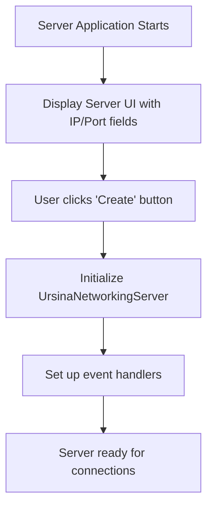
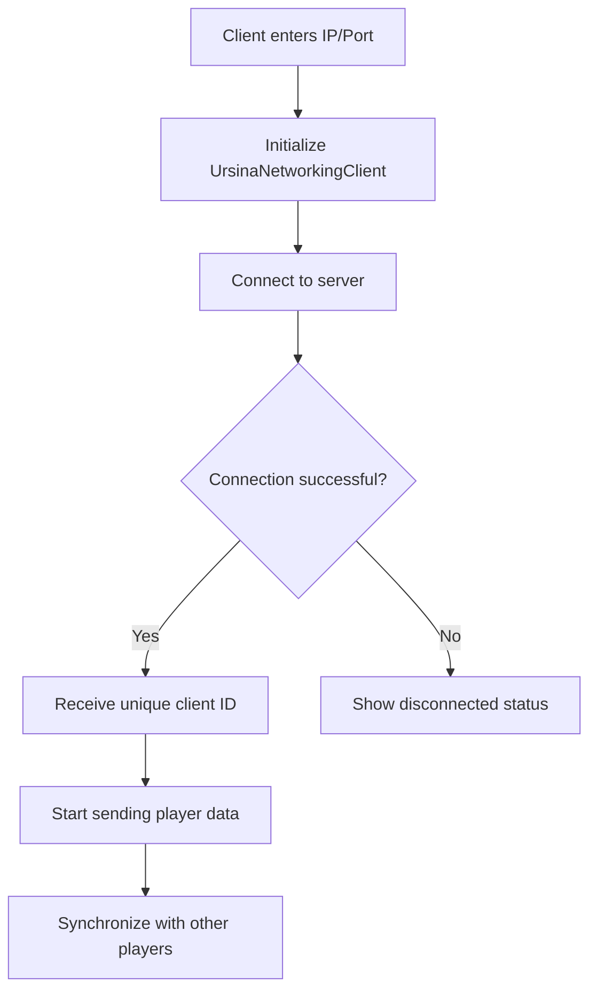
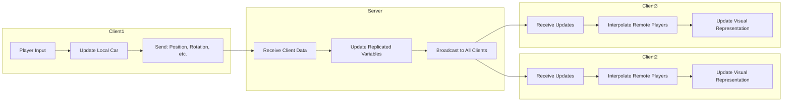
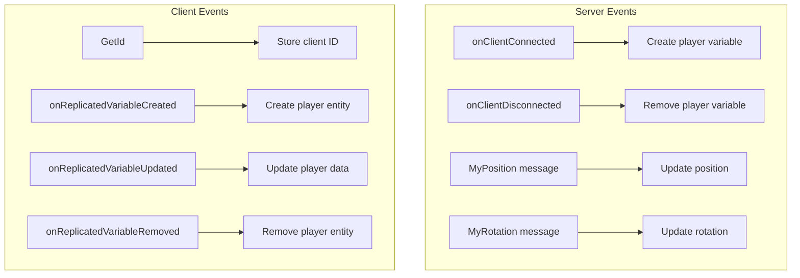
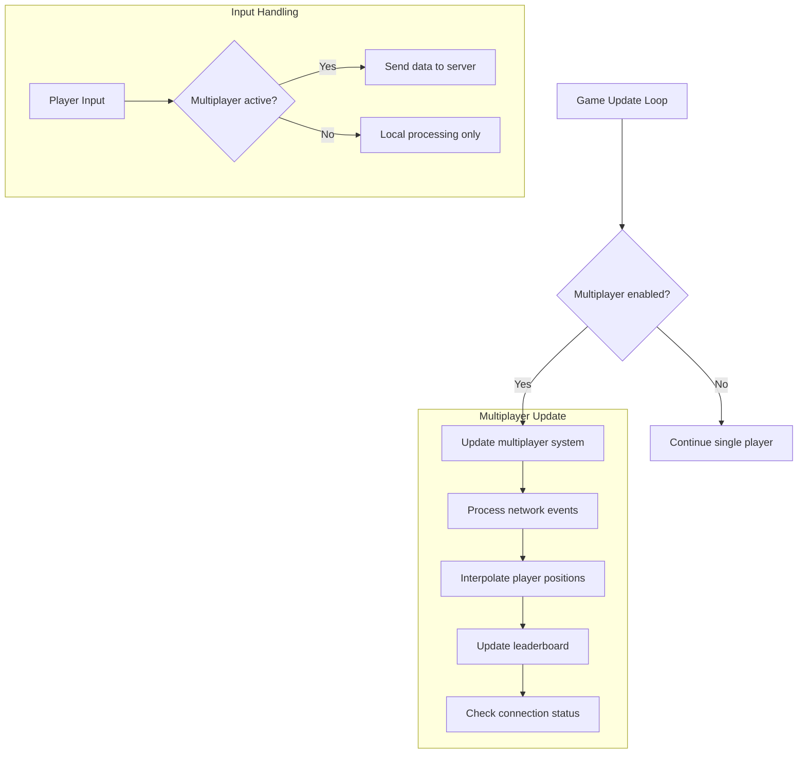
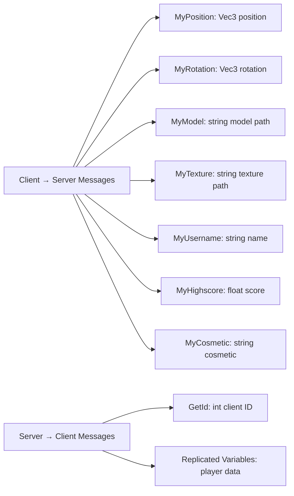

# Rally Multiplayer Flowchart

## Server Startup Sequence


## Client Connection Sequence


## Data Synchronization Flow


## Event Handling


## Multiplayer Game Loop


## Network Message Types


## Player Representation
```mermaid
flowchart TD
    A[Remote Player] --> B[CarRepresentation Entity]
    B --> C[3D Model & Texture]
    B --> D[Cosmetic Items]
    B --> E[Username Text]
    B --> F[Highscore Display]
    
    G[Local Player] --> H[Main Car Entity]
    H --> I[Full Physics]
    H --> J[Input Handling]
    H --> K[Audio & Effects]
    
    style H fill:#e6f3ff
